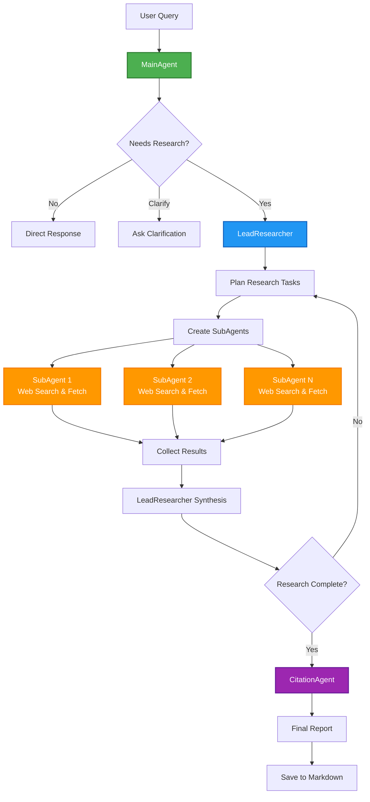
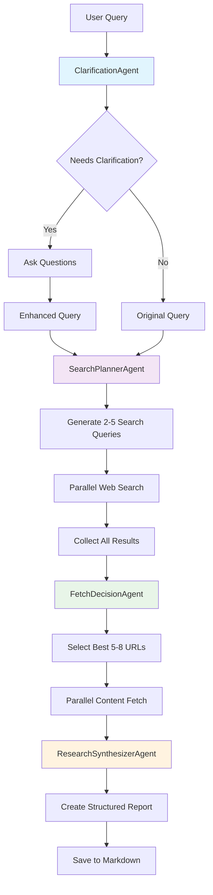

# AI Research Agent Tutorial Series

This repository contains two different implementations of AI research agents for educational purposes. Both systems perform deep research on user queries and save results to markdown files, but they use different architectural approaches.

## 🚀 Quick Start

1. **Install Dependencies**

   ```bash
   npm install
   ```

2. **Set Up API Keys**
   Create a `.env` file in the root directory:

   ```env
   OPENAI_API_KEY=your_openai_api_key_here
   TAVILY_API_KEY=your_tavily_api_key_here
   ```

3. **Run the Tutorial**

   ```bash
   npm start
   ```

   This will show you a menu to choose between implementations!

## Alternative Usage

You can also run each implementation directly:

```bash
# Multi-Agent System
npm run multi-agent

# Structured Output System
npm run structured
```

## Implementation 1: Multi-Agent System

**Location:** `multi-agent/`

### Architecture

This implementation uses a sophisticated multi-agent architecture with dynamic orchestration:

- **MainAgent**: Decides whether to answer directly, ask clarification questions, or trigger research
- **LeadResearcher**: Orchestrates research process, plans tasks, and synthesizes findings iteratively
- **SubAgents**: Execute specific research tasks in parallel using web search and fetch tools
- **CitationAgent**: Formats final reports with proper citations

### Key Features

- **Dynamic Planning**: LeadResearcher adapts research strategy based on findings
- **Parallel Execution**: Multiple SubAgents work simultaneously on different aspects
- **Iterative Process**: Can perform multiple rounds of research with synthesis between rounds
- **Conversation Memory**: Maintains context across user interactions
- **Automatic Citations**: Properly formats and numbers source citations

### Workflow

1. User asks question
2. MainAgent determines if research is needed
3. LeadResearcher creates research plan
4. SubAgents execute tasks in parallel
5. LeadResearcher synthesizes findings
6. Process repeats if more research is needed
7. CitationAgent formats final report
8. Report saved to `reports/research-[timestamp]-[query].md`

## Implementation 2: Structured Output System

**Location:** `structured-output/`

### Architecture

This implementation uses a linear pipeline with structured outputs for triaging:

- **ClarificationAgent**: Analyzes queries and asks clarifying questions when needed
- **SearchPlannerAgent**: Analyzes query and produces optimized search queries
- **FetchDecisionAgent**: Selects best URLs from search results for content fetching
- **ResearchSynthesizerAgent**: Synthesizes fetched content into comprehensive report

### Key Features

- **Intelligent Clarification**: Asks targeted questions to improve research quality
- **Structured Decision Making**: Each agent uses structured output schemas
- **Linear Pipeline**: Clear, predictable flow through research stages
- **Programmatic Web Search**: Direct integration with search and fetch functions
- **Quality-Based URL Selection**: Intelligent filtering of search results
- **Comprehensive Synthesis**: Single-pass synthesis of all gathered content

### Workflow

1. ClarificationAgent analyzes query and asks clarifying questions if needed
2. SearchPlannerAgent creates 2-5 optimized search queries (with clarification context)
3. System executes all queries in parallel
4. FetchDecisionAgent selects best 5-8 URLs from results
5. System fetches detailed content from selected URLs
6. ResearchSynthesizerAgent creates comprehensive report
7. Report saved to `reports/research-structured-[timestamp]-[query].md`

## System Architecture Diagrams

### Multi-Agent System Flow



### Structured Output System Flow



## Comparison

| Aspect              | Multi-Agent                                              | Structured Output                                                    |
| ------------------- | -------------------------------------------------------- | -------------------------------------------------------------------- |
| **Complexity**      | High - Dynamic orchestration                             | Medium - Linear pipeline with clarification                          |
| **Flexibility**     | Very flexible, adaptive                                  | More predictable, systematic                                         |
| **Research Depth**  | Iterative, can go deeper                                 | Single-pass, comprehensive                                           |
| **Performance**     | Variable based on query complexity                       | Consistent, faster                                                   |
| **Use Case**        | Complex research requiring iteration                     | Straightforward research with known scope                            |
| **Agent Count**     | 4+ (MainAgent, LeadResearcher, SubAgents, CitationAgent) | 4 (Clarification, SearchPlanner, FetchDecision, ResearchSynthesizer) |
| **Search Strategy** | Dynamic based on findings                                | Planned upfront with clarification                                   |
| **Output Format**   | Formatted with citations                                 | Structured markdown report                                           |
| **Clarification**   | Built into MainAgent decision flow                       | Dedicated ClarificationAgent step                                    |

## File Structure

```
research_agent/
├── index.ts              # 🎯 Master entry point (run this!)
├── multi-agent/
│   ├── index.ts          # Multi-agent main entry point
│   ├── agents.ts         # Agent definitions
│   ├── perform-research.ts # Research orchestration
│   ├── prompts.ts        # Agent prompts
│   ├── response-schemas.ts # Structured output schemas
│   ├── tools.ts          # Web search and fetch tools
│   └── utils.ts          # Utilities and logging
├── structured-output/
│   ├── index.ts          # Structured output main entry point
│   ├── agents.ts         # Three specialized agents
│   ├── prompts.ts        # Agent prompts
│   ├── schemas.ts        # Structured output schemas
│   ├── tools.ts          # Web search and fetch functions
│   └── utils.ts          # Utilities and markdown saving
├── reports/              # Generated research reports (auto-created)
├── package.json
└── README.md
```

## Output

Both implementations save research reports to the `reports/` directory with:

- Timestamped filenames
- Structured markdown format
- Query metadata
- Source citations
- Professional formatting

## Educational Value

- **Multi-Agent**: Demonstrates complex agent orchestration, dynamic planning, and iterative research
- **Structured Output**: Shows structured decision-making, linear pipelines, and systematic processing

Choose the implementation that best fits your learning goals and use case requirements!
